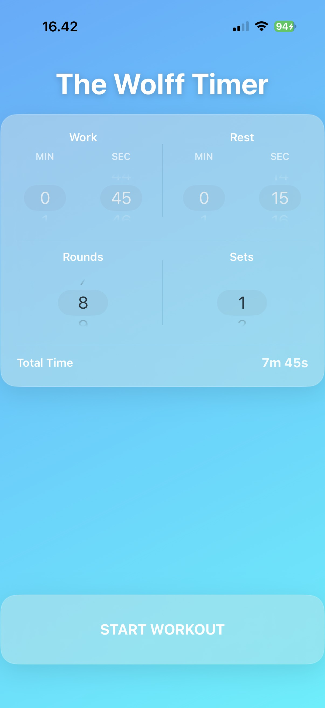
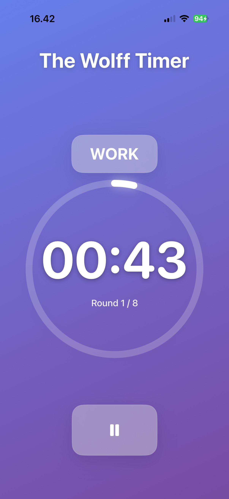
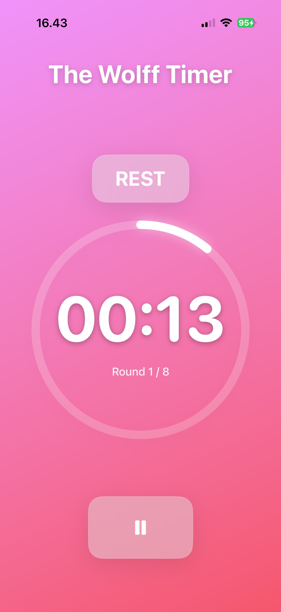
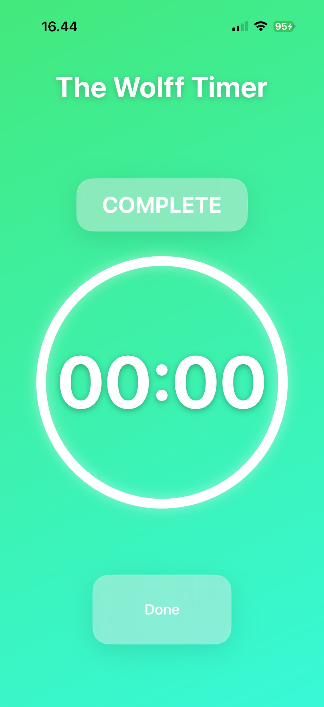

# The Wolff Timer

A beautifully designed interval timer for circuit training, HIIT, Tabata, and any workout that needs precise timing.

## Features

- **Customizable Intervals** - Set your work time, rest time, rounds, and sets
- **Live Activity** - See your timer on Lock Screen and Dynamic Island
- **Background Reliable** - Timer keeps running accurately when phone is locked
- **Music Friendly** - Audio cues lower your music volume, then restore it
- **No Distractions** - No ads, no subscriptions, no account required

## Screenshots

  
  
  
  

## Requirements

- iOS 16.1 or later
- iPhone (optimized for all sizes)

## Support

Having issues or have a suggestion?

- **Email**: timer.wolff@gmail.com
- **Issues**: [Open an issue](https://github.com/JimmiWolff/Timer-APP/issues)

## Privacy

The Wolff Timer does not collect any personal data. All timer configurations are stored locally on your device.

[Read our Privacy Policy](https://jimmiwolff.github.io/Timer-APP/)

## License

MIT License - see [LICENSE](LICENSE) for details.

---

  Made with care for people who train.

